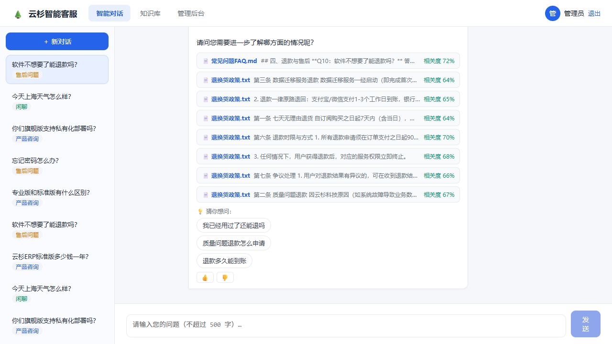

# 云杉智能客服 — 企业级 LLM 智能客服系统

> 海鹚科技 AI 开发工程师笔试题作品：基于大语言模型的智能客服系统，实现 **RAG 检索增强问答 + SSE 流式输出 + 知识库管理** 的完整 AI 对话链路。



## ✨ 功能一览

| 模块 | 功能 |
|------|------|
| 💬 **智能问答** | RAG 链路（检索→Prompt→LLM→流式）、逐字输出、引用来源卡片、多轮对话、追问建议 |
| 🧠 **知识库** | 上传 `.txt/.md/.pdf` 自动向量化、处理状态机、级联删除、增量更新、多知识库自动路由 |
| 🧠 **Agent 记忆系统** | L0-L3 分层（对话→原子记忆→画像）、Mem0 式去重与冲突检测、遗忘机制、防串扰隔离、个性化注入 |
| 🏷️ **意图识别** | 产品咨询 / 售后问题 / 闲聊 / 投诉，会话记录自动标注 |
| 👍 **用户反馈** | 点赞/踩 + 选填文字，AI 回答质量闭环 |
| 📊 **管理后台** | 全量会话记录、反馈统计、近 7 日问答量折线图 |
| 🔒 **业务规则** | 500 字上限、每日 100 次限额（原子计数）、空检索兜底不编造 |

## 🏗️ 架构

```
前端 React+TS (Vite) ──REST / SSE──▶ FastAPI 后端 ──▶ DeepSeek API（流式）
                                       │             └─▶ 本地 bge-small-zh Embedding
                                       ├─▶ MySQL 8（用户/会话/消息/文档/用量）
                                       └─▶ Chroma（向量检索，本地持久化）
```

**RAG 核心链路**：`用户提问 → 意图识别 → 查询改写 → 多路召回（子块向量 + 父块 BM25，RRF 融合）→ LLM 重排（精排 + 相关性判定）→ 规则类软加成 → Token 预算 → Prompt 拼接（完整父块）→ LLM 流式生成 → 引用来源 + 追问建议`

**企业级设计**：两段式检索（多路召回保覆盖率 → LLM 重排保精度）；Parent-Child 分块（180 字子块检索精准命中，完整父块进 Prompt 保上下文）；**Agent 记忆系统**（L0-L3 分层沉淀、写入去重、画像冲突检测、遗忘机制、user_id 硬隔离、问答前个性化注入）；离线评估（LLM-as-judge）实测 **faithfulness 1.00、零幻觉**。

针对 AI 工程问题的完整设计（空检索兜底 / 上下文超长压缩 / 幻觉治理的引用编号机制 / 大规模上下文下的规则保障），见 [项目说明.md](项目说明.md) 与 [docs/AI架构设计.md](docs/AI架构设计.md)。

## 🚀 快速开始（约 10 分钟）

环境要求：Docker、Python 3.10+、Node 18+。

```bash
# 1. 启动 MySQL
cd backend && docker compose up -d

# 2. 后端依赖 + 配置
python -m venv .venv
.venv/Scripts/pip install -r requirements.txt
cp .env.example .env            # 填入你的 DeepSeek API Key（LLM_API_KEY=）
.venv/Scripts/python scripts/init_db.py

# 3. 启动后端（自动下载 embedding 模型 + 向量化示例文档）
.venv/Scripts/python -m uvicorn app.main:app --port 8000

# 4. 前端
cd ../frontend && npm install && npm run dev
```

访问 **http://localhost:5173**，演示账号：`13800000000 / admin123`（管理员）。

> 没有 DeepSeek Key？可切换任意 OpenAI 兼容端点（通义千问/月之暗面/Groq 免费额度）或本地 Ollama，见 [运行指南.md](运行指南.md)。

## 🧪 测试

```bash
cd backend
.venv/Scripts/python -m pytest tests/ -v          # 15 项单元/集成测试
.venv/Scripts/python scripts/smoke_test.py         # 端到端冒烟（10 项）
.venv/Scripts/python scripts/qa_check.py           # 问答质量验证（6 题）
```

测试覆盖：分块策略（章节原子化/标题合并/超长切割）、认证、500 字限制、每日限额原子计数（并发安全）、上传格式校验、文档生命周期、管理后台权限、SSE 事件序列、空检索兜底。

## 📁 目录结构

```
├── backend/            # FastAPI：RAG 链路、SSE、知识库、认证、限额
│   ├── app/services/   # rag / llm / embedding / vector_store / knowledge / usage
│   ├── tests/          # pytest 测试套件
│   ├── scripts/        # 初始化 / 冒烟 / 质量验证脚本
│   └── data/seed_docs/ # 3 篇示例文档（启动自动向量化）
├── frontend/           # React 19 + TS：流式对话 / 知识库 / 后台
├── docs/               # API 文档 / 数据库设计 / AI 架构设计 / 业务流程说明
├── 项目说明.md          # 选型论证、AI 工程问题处理、AI 工具使用体会、质量验证
└── 运行指南.md          # 完整运行与配置说明
```

## 🛠️ 技术栈

**后端** FastAPI · SQLAlchemy · MySQL 8 · Chroma · DeepSeek API · bge-small-zh（可插拔 Embedding）
**前端** React 19 · TypeScript · Vite（fetch + ReadableStream 手写 SSE 解析）
**部署** Docker Compose（MySQL）· 本地向量库免独立服务

## 📚 文档

- [项目说明.md](项目说明.md) — 技术选型、AI 工程问题处理（重点）、AI 工具使用体会、回答质量验证
- [docs/API文档.md](docs/API文档.md) — 全部接口 + SSE 事件协议
- [docs/AI架构设计.md](docs/AI架构设计.md) — RAG 流程图、Prompt 模板、检索策略、迭代记录
- [docs/数据库设计.md](docs/数据库设计.md) — ER 图 + 表结构
- [docs/业务流程说明.md](docs/业务流程说明.md) — 问答完整链路图
- [运行指南.md](运行指南.md) — 环境配置、模型切换、常见问题
