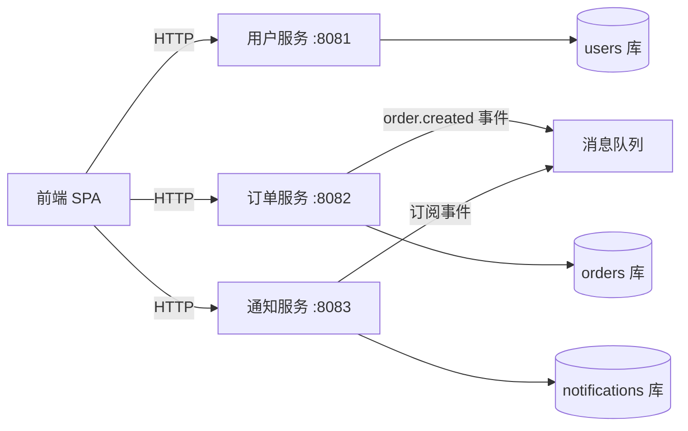

# 示例系统技术文档（Agent 任务拆解演示用）

电商系统「文博商城」的微服务架构。Agent 收到需求后，依据本文档判断改哪些服务、哪些可并行、哪些必须串行。

## 系统总览

## 1. 前端（frontend-spa）

- 技术栈：React 19 + TypeScript
- 关键页面：商品列表 `/products`、下单页 `/checkout`、订单列表 `/orders`、个人中心 `/profile`
- API 调用：通过网关访问各服务；登录后 localStorage 存 token
- 下单流程：`/checkout` 页 → 调用订单服务 `POST /api/orders` → 轮询 `GET /api/orders/{id}` 获取状态

## 2. 用户服务（user-service）

- 端口 :8081，数据库 `users`
- 接口：
  - `POST /api/users/register` — 注册（入参：手机号、密码）
  - `POST /api/users/login` — 登录（返回 JWT）
  - `GET /api/users/{id}/profile` — 用户资料
- 数据表 `users`：`id, phone, password_hash, nickname, created_at`
- **用户手机号字段：`users.phone`（通知功能的数据依赖）**

## 3. 订单服务（order-service）

- 端口 :8082，数据库 `orders`
- 接口：
  - `POST /api/orders` — 创建订单（入参：商品列表、用户 token；**成功后发布 `order.created` 事件到消息队列**）
  - `GET /api/orders/{id}` — 订单详情（含 `status`：pending/paid/shipped/completed/cancelled）
  - `POST /api/orders/{id}/cancel` — 取消订单
- 数据表 `orders`：`id, user_id, product_ids, amount, status, created_at`
- **事件：`order.created` 已存在，payload 含 `order_id, user_id, amount`（供通知服务订阅）**

## 4. 通知服务（notification-service）

- 端口 :8083，数据库 `notifications`
- 接口：
  - `POST /api/notifications/send` — 发送通知（入参：`channel`（sms/email/push）、`to`、`template_id`、`params`）
  - `GET /api/notifications/records` — 发送记录查询
- 数据表 `notifications`：`id, channel, to, template_id, params, status, created_at`
- **已支持短信通道（sms），需在控制台配置短信签名与模板后生效**
- 事件消费：已订阅消息队列，可注册 `order.created` 处理器
- 通知模板表 `notification_templates`：`id, code, title, content`（**"下单成功通知"模板 code=order_created_sms 尚未创建**）

## 依赖关系速查（Agent 判定依据）

| 服务 | 依赖别人 | 被别人依赖 |
|------|----------|------------|
| 前端 | 用户/订单/通知的 API | 无 |
| 用户服务 | 无 | 前端、订单服务 |
| 订单服务 | 用户服务（token 鉴权） | 前端、通知服务 |
| 通知服务 | 订单服务（order.created 事件）、用户服务（手机号） | 前端 |
