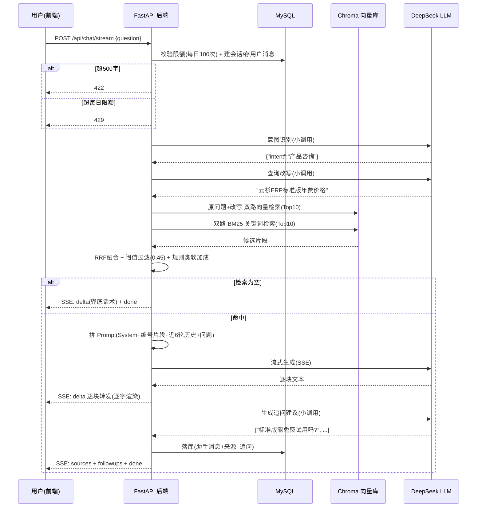
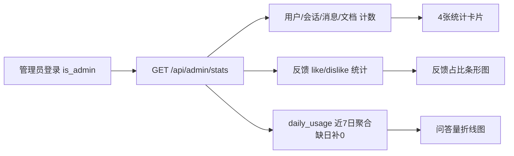

# 业务流程说明

## 1. 核心链路：一次智能问答的完整旅程



## 2. 知识库管理流程

```mermaid
flowchart LR
    A[上传文档 txt/md/pdf] --> B[保存文件到 uploads/]
    B --> C[创建 Document 记录 status=processing]
    C --> D[后台任务: 解析文本]
    D --> E[分块: 章节单元原子化 + 标题合并]
    E --> F[类别标注 rule/faq/product/other]
    F --> G[本地 bge 向量化]
    G --> H[写入 Chroma metadata含doc_id]
    H --> I[status=ready + chunk_count]
    D -->|解析失败| J[status=failed + error_msg]
    I --> K[前端轮询 GET /api/knowledge/{id}]
    J --> K
    L[删除文档] --> M[按doc_id清Chroma向量]
    M --> N[删元数据+本地文件]
```

## 3. 会话管理流程

```mermaid
flowchart TD
    A[新对话] --> B[POST /api/chat/stream session_id=null]
    B --> C[服务端创建 Session<br/>title=首问前20字]
    C --> D[首次问答意图写入 Session.intent]
    D --> E[后续轮次携带 session_id<br/>上下文取最近6轮]
    E --> F[历史会话列表<br/>GET /api/sessions 按updated_at倒序]
    F --> G[会话详情<br/>GET /api/sessions/{id}/messages]
    G --> H[对回答 点赞/踩 + 选填文字]
```

## 4. 多轮对话上下文管理

- 每轮 = 1 条 user 消息 + 1 条 assistant 消息；
- 取最近 `RAG_HISTORY_ROUNDS`（默认 6）轮 = 最近 12 条消息；
- **字符预算截断**（`_truncate_history`）：从新到旧累计，超 2000 字预算即停止，保证最新的上下文一定完整、最旧的可被丢弃；
- 历史消息在 Prompt 中单独分区（`【历史对话】`），与当前问题隔离，防止模型把历史陈述当作新的指令。

## 5. 业务规则落地

| 规则 | 实现位置 | 行为 |
|------|----------|------|
| 单次提问 ≤ 500 字 | `routers/chat.py` 流开始前 | 超限 422，直接返回，不进入 AI 链路 |
| 每日 ≤ 100 次（可配） | `services/usage.py` + `daily_usage` 表 | 先查后增（幂等），超限 429 |
| 检索为空不编造 | `services/rag.py` 阈值过滤 | 低于 0.45 → 兜底话术（`FALLBACK_REPLY` 可配），**不调用 LLM** |
| 流式逐字输出 | SSE delta 事件 | 前端 ReadableStream 解析，边收边渲染 |

## 6. 管理后台流程（加分项）


