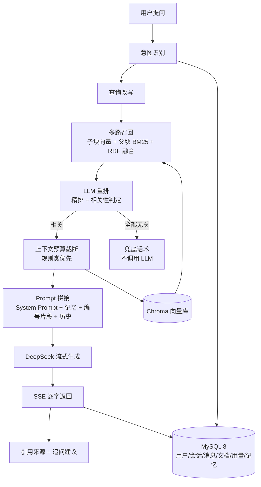
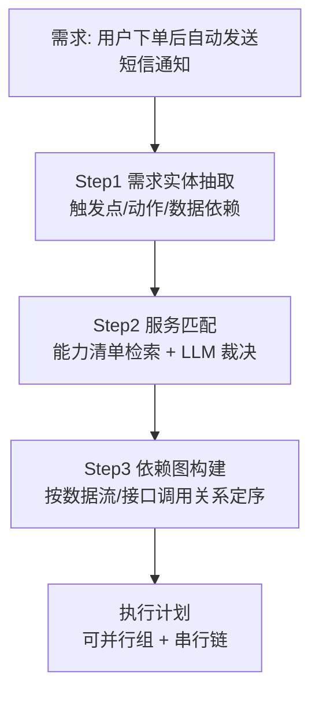

# 项目说明

海鹚科技 AI 开发工程师笔试题：基于 LLM 的智能客服系统（RAG + 流式输出）。

本文档说明：技术选型与理由、整体 AI 架构、AI 特有工程问题的处理思路、AI 编程工具使用体会、回答质量验证方法。

## 1. 技术选型及原因

| 组件 | 选型 | 理由 |
|------|------|------|
| 对话 LLM | DeepSeek `deepseek-chat` | 中文能力强、流式稳定、成本低；OpenAI 兼容协议，`llm.py` 可切换任意兼容端点 |
| Embedding | 本地 `bge-small-zh-v1.5` | DeepSeek 不提供 embedding API；bge 中文优化、CPU 可跑、免注册；抽象为可插拔 Provider，可切 SiliconFlow bge-m3 等 |
| 向量库 | Chroma 本地文件模式 | 免独立服务（题目 FAQ 允许），元数据过滤支持文档级联删除 |
| 数据库 | MySQL 8（Docker） | 题目指定；docker-compose 一键拉起 |
| 后端 | Python FastAPI + SQLAlchemy | 原生 SSE 流式响应、异步 LLM 客户端、Pydantic 类型校验 |
| 前端 | React 19 + TypeScript + Vite | 题目二选一；fetch + ReadableStream 手写 SSE 解析，支持中断与逐字渲染 |

选型权衡的完整说明（含 embedding 模型规模取舍与升级路径）见 [`docs/AI架构设计.md`](docs/AI架构设计.md) 第 1 节。

## 2. 整体 AI 架构图



## 3. AI 特有工程问题处理（重点）

### 3.1 检索为空

**问题**：问题在知识库中无对应内容，或相似度极低。强行回答会导致编造。

**方案**：

1. **相似度阈值过滤**：检索结果须 ≥ 0.45（bge-small-zh 余弦，可配置）才进入 Prompt；
2. **空检索短路**：过滤后为空则不调用 LLM，直接返回标准兜底话术（可配置），零幻觉成本且省一次 LLM 调用；
3. **System Prompt 兜底声明**：检索结果存在但内容不相关时，规则强制模型声明"知识库中暂无相关信息"而非编造。

**验证**：提问"今天上海天气怎么样？"触发兜底话术，不调用 LLM。

### 3.2 上下文超长

**问题**：片段数量多、多轮历史累积长，全塞进 Prompt 会超窗口并稀释注意力。

**方案（四个独立预算）**：

| 预算 | 默认值 | 作用 |
|------|--------|------|
| `RAG_TOP_K` | 6 | 最终进入 Prompt 的片段数上限 |
| `RAG_CONTEXT_BUDGET_CHARS` | 3000 字 | 片段总字符预算，超出从低优先级丢弃 |
| `RAG_HISTORY_ROUNDS` | 6 轮 | 历史携带轮数 |
| `compress_history` | 2000 字触发 | 历史超长时分层压缩 |

**多轮历史分层压缩**（`rag.compress_history`）：历史 ≤ 2000 字不压缩；超长时最近 3 轮保留原文，更早轮次由 LLM 压缩为 ≤300 字摘要（保留价格/政策等关键结论），压缩失败回退截断。

### 3.3 LLM 幻觉

按幻觉形态分别治理：

| 幻觉形态 | 治理手段 |
|----------|----------|
| 无中生有（知识库没有却编造） | ① 空检索短路不调用 LLM；② System Prompt"无依据必须声明" |
| 漏读关键限定（知识库有但漏了） | ① 章节原子化分块（每条款独立成块）；② 规则类片段软加成；③ System Prompt 要求回答前逐条核对规则片段 |
| 混淆不同来源（A 文档规则说成 B 的） | ① 片段带来源文档名；② 引用编号强制标注 `[n]`，每个结论可回溯到片段 |

**引用编号机制**：把"是否编造"从模型内部行为变成可校验的输出——回答中没有编号的结论视为编造；前端同步展示编号对应的来源卡片，形成"回答—引用—来源"闭环。

## 4. 大规模上下文下的 LLM 执行保障（加分项）

知识库文档多、检索片段数十条时，保证 LLM 不漏关键规则、不编造不混淆。设计已实现于代码，详见 [`docs/AI架构设计.md`](docs/AI架构设计.md) 第 5 节：

1. **分块层——语义原子化**：`chunk_text()` 把章节单元（`一、`/`1.`/`Q1：`/`第X条`）独立成块。多知识点合并的大块会把定价信息埋在段中，模型读到但读不出——原子化后每个版本/条款/FAQ 条目是独立检索单元，命中即完整语义；
2. **检索层——规则优先软加成**：分块时按关键词分类（rule/faq/product/other），RRF 融合分上加 `rule +0.25` 软加成，规则类片段稳定进入 Prompt 前部；软加成不压制强相关的产品/FAQ 块；
3. **Prompt 层——编号 + 优先级 + 引用强制**：片段带 `[n]` 编号与类别标签，System Prompt 要求"回答涉及退货、退款、赔偿等问题前先逐条核对规则类片段""关键结论标注引用编号，无编号依据视为编造"。

**效果验证**（见第 6 节验证表）：退款类问题回答覆盖 7 天无理由/仅限首购/90 天时限/原路退回/服务权限终止等 5+ 条互相限定的规则，全部标注引用编号。

## 5. 终极挑战：AI Agent 的任务拆解能力（加分项）

> 场景：Agent 收到需求"用户下单后自动发送短信通知"，面对一套含前端、用户服务、订单服务、通知服务的系统，判断改哪些服务、哪些可并行、哪些有依赖。
>
> **代码实现**：`backend/agent_demo/agent.py` + `system_docs.md`（示例系统技术文档）。运行：
> ```bash
> cd backend
> .venv/Scripts/python agent_demo/agent.py "用户下单后自动发送短信通知"
> ```

### 5.1 三步拆解



**Step 1 需求实体抽取**：把需求解析为结构化三元组——`触发事件`（下单成功）、`动作`（发送短信）、`数据依赖`（用户手机号、订单号、通知模板），LLM 输出 JSON。

**Step 2 服务匹配**：为每个微服务建立能力清单（接口、数据表、职责）。匹配用"实体-能力"双通道：按实体名向量检索候选服务，再让 LLM 依据接口文档确认能力是否真实存在，避免凭印象臆断服务边界。

**Step 3 依赖图构建**：

- **可并行**（无数据依赖）：不依赖短信服务改动的独立改动；
- **必须串行**（有数据/接口依赖）：先改订单服务（发布 `order.created` 事件）→ 再改通知服务（订阅事件并调 `sms.send()`）→ 最后前端接入通知状态；
- **判定规则**：若 A 的输入是 B 的输出（接口签名、数据表字段、消息事件），则 A 依赖 B，构成有向边；有环则报错要求人工确认。

### 5.2 示例输出（"用户下单后自动发送短信通知"）

| 服务 | 判定 | 依据 |
|------|------|------|
| notification-service | 需要改动（创建模板 `order_created_sms` + 注册事件处理器） | 依赖 order.created 事件与用户手机号 |
| order-service | 无需改动（事件已存在且 payload 完整） | 文档明确"order.created 已存在" |
| user-service | 无需改动（profile 接口已返回 phone） | 文档明确接口已存在 |

执行顺序：`order-service`、`user-service` 可并行（互不依赖）→ `notification-service` 串行在后（依赖两者的输出）。

Agent 的"无需改动"判断与 RAG 的"检索为空不编造"同理：没有文档依据就不声称要改——System Prompt 明确"不得臆造文档中不存在的接口"，这是防止 Agent 幻觉的核心约束。

### 5.3 与 RAG 系统的同构性

拆解本质是"检索（能力清单）+ 结构化推理（依赖图）"，与 RAG 链路同构：

- 能力清单 ≈ 知识库片段（检索对象），向量+关键词混合检索定位；
- 依赖判定 ≈ 规则类片段（约束条件），需 LLM 逐条核对；
- 输出带引用（哪个服务的哪个接口/字段）≈ 回答带来源引用。

## 6. RAG 回答质量评估与验证

测试集 + 指标验证（`backend/scripts/qa_check.py`）：

| 测试问题 | 期望 | 结果 |
|----------|------|------|
| 云杉ERP标准版多少钱一年？ | 答出 3999 元/年 + 来源 | 命中定价条款，引用标注 |
| 软件不想要了能退款吗？ | 覆盖 7 天无理由/仅限首购/90 天时限/到账时效/权限终止 | 5+ 条规则全引用（[1][3][4][6][7]） |
| 专业版和标准版有什么区别？ | 价格、功能、存储、实施服务对比 | 完整对比表 |
| 忘记密码怎么办？ | FAQ Q1 步骤 | 通过 |
| 你们旗舰版支持私有化部署吗？ | 8 核 16G、5-10 工作日 | 通过 |
| 今天上海天气怎么样？ | 兜底话术，不编造 | 通过 |
| 超 500 字提问 | 422 | 通过 |
| 多轮指代（"那标准版多少钱"） | 结合上文回答 | 通过 |
| 上传 .pdf 后问 PDF 内容（老客户续费 8 折） | 新文档立即可检索（增量更新） | 通过 |
| 上传新文档后问旧文档内容（旗舰版 19999） | 旧向量不受影响 | 通过 |
| 指定空知识库提问 | 兜底话术 | 通过 |

**消融对比**：5 个知识问答问题中，纯向量检索有 3 个问题的答案块排不进 Top-5（"标准版定价"块排第 7）；多路召回（向量+BM25+RRF）后全部命中 Top-3；规则类问题经软加成后规则片段稳定占据 Prompt 前部。

**离线评估**（LLM-as-judge，`backend/eval/rag_eval.py`）：6 条测试集（含 1 条反幻觉用例）——平均 **faithfulness 1.00**（回答结论全部可被检索上下文支撑）、期望命中率 100%、无幻觉 100%。评估的关键设计：judge 看到的上下文是真实进入 Prompt 的完整父块（进程内调用检索链路），而非 API 返回的 80 字截断摘要——评估输入必须与线上链路一致，否则评估结果不可信。

## 7. 使用 AI 编程工具的体会（必须说明）

### 7.1 使用的工具

- **AI 编程助手**：Claude Code（脚手架、代码编写、调试、文档撰写全程人机协作）
- **LLM API**：DeepSeek `deepseek-chat`（对话生成/意图分类/查询改写/追问建议）
- **Embedding**：本地 bge-small-zh-v1.5（本地推理，非 LLM API）

### 7.2 构建 RAG 链路时对 AI 生成代码的优化与修正

初版链路能跑通，但检索质量不达标。RAG 的关键不在"能不能跑"，而在检索准确性与上下文质量。主要优化修正：

1. **分块策略重写**（字符硬切 → 章节原子化）：初版把多个知识点合并进大块，定价信息埋在段中难以被读出；重写为章节单元独立成块后，"标准版定价"从检索盲区变为稳定命中；
2. **短标题块合并**：原子化后 6-10 字的标题块（"二、核心产品"）纯关键词命中挤占 Top-5，加入"<20 字并入下一块"规则；
3. **混合检索引入**（纯向量 → 向量+BM25+RRF）：初版只有向量检索，"标准版多少钱"答案块排第 7（被噪音块压制）；引入 BM25 关键词路 + RRF 融合后全部测试问题命中 Top-3；
4. **排序策略调整**（硬排序 → 软加成）："规则类硬排序+每类上限"会把产品类答案块挤出上下文，改为 RRF 主序 + 规则软加成；
5. **查询改写双路合并**：单用 LLM 改写做检索词会让部分问题召回变差（改写词与文档原文脱节），改为"原问题+改写"双路检索取并集；
6. **异步/异常链审计**：意图识别、追问建议、查询改写三处存在"async 未 await / .format() 与 {JSON} 冲突"的静默失败（功能永远走降级分支），逐一修正并补充失败降级日志。

### 7.3 协作体会

1. **AI 产出需要验收**：初版代码 10 分钟生成，但检索质量问题经 3 轮"写测试问题 → 跑 → 看失败模式 → 定位根因"才解决。没有测试集的 AI 编程是盲写；
2. **调试 RAG 必须看中间产物**：直接问 AI"为什么排第 7"得到泛泛解释；打印检索排名后 3 分钟找到根因。不能只看最终回答；
3. **Prompt 是代码**：System Prompt 的"引用编号强制""规则核对"两条规则直接改变模型行为（漏"仅限首次购买"的问题在加规则后消失），Prompt 的每次修改需要回归验证；
4. **架构比 prompt 更能解决问题**：幻觉治理最有效的不是"你别编造"的提示，而是空检索短路（不调用 LLM）、原子化分块、混合检索这些工程手段——LLM 能力边界之外的问题用系统设计解决。
