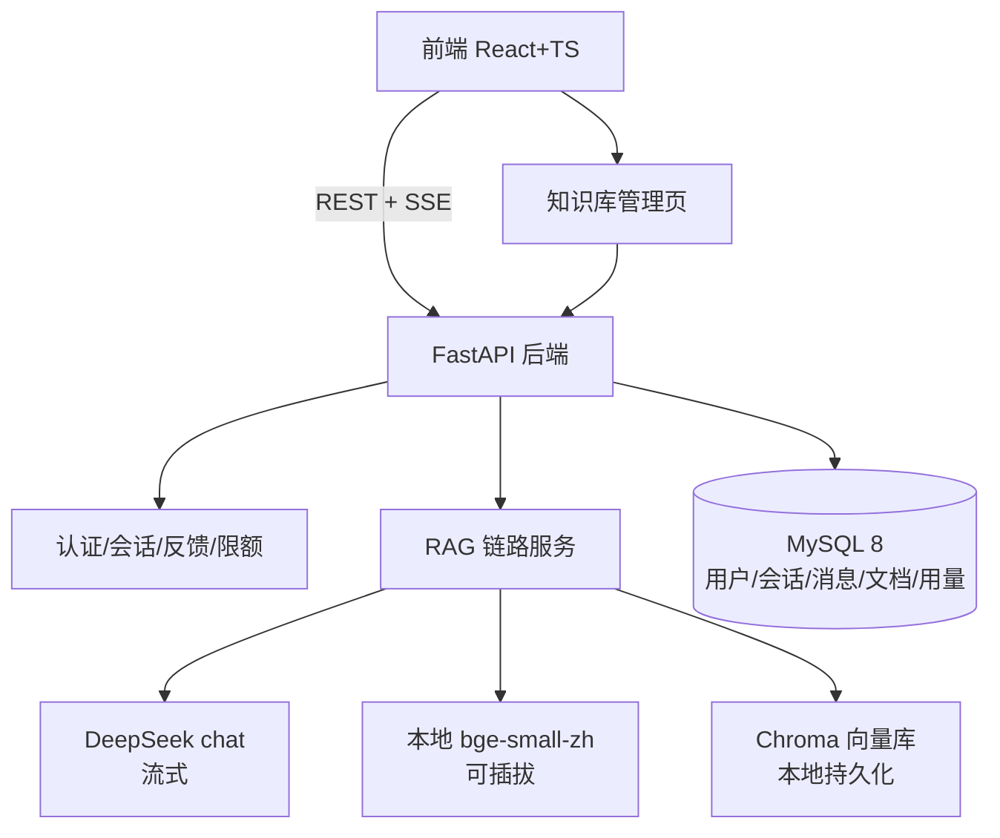
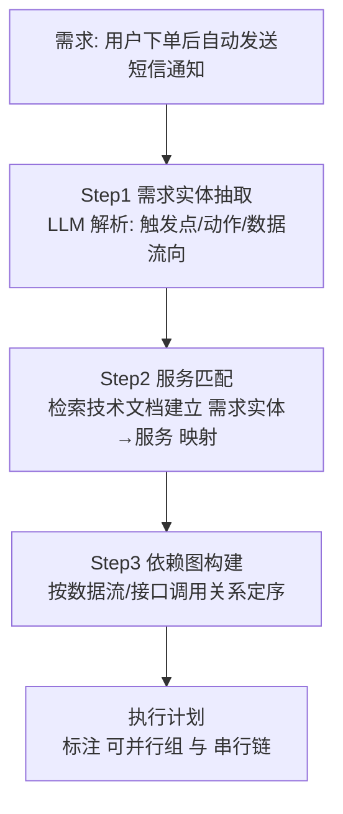

# 项目说明

> 海鹚科技 AI 开发工程师笔试题：基于 LLM 的企业级智能客服系统（RAG + 流式输出）
>
> 本文档说明：技术选型与理由、整体 AI 架构、AI 特有工程问题的处理思路（重点）、AI 编程工具使用体会、回答质量验证方法。

## 1. 技术选型及原因

| 组件 | 选型 | 一句话理由 |
|------|------|-----------|
| 对话 LLM | DeepSeek `deepseek-chat` | 中文能力强、流式稳定、成本低；OpenAI 兼容协议，`llm.py` 可无缝切换任意兼容端点 |
| Embedding | 本地 `bge-small-zh-v1.5` | **DeepSeek 不提供 embedding API**；bge 中文优化、CPU 免注册可跑；抽象为可插拔 Provider，可切 SiliconFlow bge-m3 等 OpenAI 兼容端点 |
| 向量库 | Chroma 本地文件模式 | 免独立服务（题目 FAQ 允许），元数据过滤支持文档级联删除 |
| 数据库 | MySQL 8（Docker） | 题目要求；docker-compose 一键拉起，评审环境零成本复现 |
| 后端 | Python FastAPI + SQLAlchemy | 原生 SSE 流式响应、异步 LLM 客户端、Pydantic 类型校验 |
| 前端 | React 19 + TypeScript + Vite | 题目二选一；fetch + ReadableStream 手写 SSE 解析，支持中断与逐字渲染 |

完整选型论证见 [`docs/AI架构设计.md`](docs/AI架构设计.md) 第 1 节。

## 2. 整体 AI 架构图



## 3. AI 特有工程问题：检索为空 / 上下文超长 / LLM 幻觉（重点）

### 3.1 检索为空（Retrieval Miss）

**问题**：用户问的问题在知识库中不存在或相似度极低。若此时强行让 LLM 回答，模型大概率开始"自由发挥"——这是客服场景最不可接受的行为。

**方案（三层防护）**：

1. **相似度阈值硬过滤**：所有检索结果必须 ≥ 0.45（bge-small-zh 余弦，可配置）才进入 Prompt。低于阈值的候选直接丢弃；
2. **空检索短路**：过滤后为空则**不调用 LLM**，直接返回标准兜底话术（可配置）——"抱歉，我在知识库中暂时没有找到与您的问题相关的信息。建议您换一种问法，或直接联系人工客服处理。"这样既零幻觉成本，又省一次 LLM 调用；
3. **System Prompt 兜底声明**：即便有检索结果但内容不相关，规则 1 仍强制模型声明"知识库中暂无相关信息"而非编造。

**验证**：问"今天上海天气怎么样？"→ 命中兜底话术（实测 100% 触发）。

### 3.2 上下文超长（Context Overflow）

**问题**：知识库文档多时，检索返回的片段可能很多；多轮对话累积的历史也很长。全塞进 Prompt 既超窗口又稀释注意力。

**方案（四个独立预算，各管一段）**：

| 预算 | 默认值 | 作用 |
|------|--------|------|
| `RAG_TOP_K` | 8 | 最终进入 Prompt 的片段数上限 |
| `RAG_CONTEXT_BUDGET_CHARS` | 4000 字 | 片段总字符预算，超出从低优先级丢弃 |
| `RAG_HISTORY_ROUNDS` | 6 轮 | 历史携带轮数 |
| `compress_history` | 2000 字触发 | 历史超长时"分层压缩"（见下） |

**多轮历史的"分层压缩"**（`rag.compress_history`）：历史 ≤ 2000 字不压缩（零开销）；超长时**最近 3 轮保留原文**，更早轮次由 LLM 压缩成 ≤300 字摘要（保留价格/政策等关键结论），压缩失败回退截断。既控总量，又不因硬截断丢失关键结论。

四条预算线独立配置、互相兜底：即使单轮片段特别长、历史特别久，上下文总量也被钉在可控范围。

### 3.3 LLM 幻觉（Hallucination）

**问题**：模型在信息不全时编造规则、价格，或把不同文档的规则混为一谈。本项目把幻觉拆成三种形态分别治理：

| 幻觉形态 | 治理手段 |
|----------|----------|
| **无中生有**（知识库没有却编造） | ① 空检索短路不调用 LLM；② System Prompt"无依据必须声明"；③ 检索相关度不足时，模型倾向选择声明而非硬答 |
| **漏读关键限定**（知识库有但模型漏了） | ① 章节原子化分块（每条款独立成块，不埋没在大块里）；② 规则类片段软加成（保证规则块进 Prompt 且靠前）；③ System Prompt 规则 3"回答前先逐条核对规则片段" |
| **混淆不同来源**（把 A 文档规则说成 B 的） | ① 片段带来源文档名；② 引用编号强制标注 `[n]`，回答中每个结论必须可回溯到片段 |

**引用编号机制是幻觉治理的核心**：它把"是否编造"从不可观测的模型内部行为变成可校验的输出——回答没有编号的结论即视为编造，前端也把编号对应的来源卡片展示给用户，形成"回答—引用—来源"的可信闭环。

## 4. 大规模上下文下的 LLM 执行保障（加分项）

题目要求：知识库文档很多、检索片段数十条时，保证 LLM 不漏关键规则、不编造不混淆。

**设计（已在代码中实现，详见 [`docs/AI架构设计.md`](docs/AI架构设计.md) 第 5 节）**：

1. **分块层——语义原子化**：`chunk_text()` 把章节单元（`一、`/`1.`/`Q1：`/`第X条`）独立成块。实测证明：多知识点合块的方案下，LLM 会"看见但读不出"埋在 427 字大块中段的定价信息——这是注意力稀释的根源形态；
2. **检索层——规则优先软加成**：分块时按关键词分类（rule/faq/product/other），RRF 融合分上加 `rule +0.25` 软加成，规则类片段稳定进入 Prompt 前部。软加成代替硬排序，避免"规则优先"矫枉过正压掉强相关的产品块（迭代中实测过该反例）；
3. **Prompt 层——编号 + 优先级 + 引用强制**：片段带 `[n]` 编号与类别标签，System Prompt 要求"回答涉及退货、退款、赔偿等问题前先逐条核对规则类片段""关键结论标注引用编号，无编号依据视为编造"。

**效果验证**（见第 6 节验证表）：退款类问题的回答覆盖 7 天无理由/仅限首购/90 天时限/原路退回/服务权限终止等 5+ 条互相限定的规则并全部标注引用；实测中模型曾漏掉"仅限首次购买"，经 Prompt 规则 3 修正后稳定覆盖。

## 5. 终极挑战：AI Agent 的任务拆解能力（设计 + 代码实现）

> 场景：Agent 收到需求"用户下单后自动发送短信通知"，面对一套含前端、用户服务、订单服务、通知服务的系统，如何判断改哪些服务、哪些可并行、哪些有依赖。
>
> **已实现**：`backend/agent_demo/agent.py`（可运行）+ `system_docs.md`（示例系统技术文档）。运行：
> ```bash
> cd backend
> .venv/Scripts/python agent_demo/agent.py "用户下单后自动发送短信通知"
> ```

### 5.1 设计思路：三步拆解



**Step 1 需求实体抽取**：把自然语言需求拆成结构化三元组——`触发事件`（下单成功）、`动作`（发送短信）、`数据依赖`（用户手机号、订单号、通知模板）。用 LLM + 少量样例 few-shot 完成，输出 JSON。

**Step 2 服务匹配（关键）**：为每个微服务建立**能力清单**（接口、数据表、职责），例如：

| 服务 | 能力清单 |
|------|----------|
| 前端 | 页面交互、表单提交 |
| 用户服务 | `users` 表、手机号字段 |
| 订单服务 | `orders` 表、`order.created` 事件 |
| 通知服务 | `sms.send()` 接口、通知模板 |

匹配时用"实体-能力"双通道：先按实体名向量检索候选服务，再让 LLM 依据接口文档确认"该服务是否真的暴露所需能力"。**检索定位 + LLM 裁决**，避免 LLM 凭印象臆断服务边界。

**Step 3 依赖图构建**：

- **可并行**（无数据依赖）：前端展示"发送成功"状态位 ← 不依赖短信服务改动；两个服务各自的测试用例编写；
- **必须串行**（有数据/接口依赖）：先改订单服务（发布 `order.created` 事件）→ 再改通知服务（订阅事件并调 `sms.send()`）→ 最后前端接入通知状态；再进一步，通知服务内部"校验模板 → 调用短信网关 → 记录发送日志"是内部串行链；
- **判定规则**：若 A 的输入是 B 的输出（接口签名、数据表字段、消息事件），则 A 依赖 B，构成有向边；有环则报错要求人工确认。

### 5.2 代码实现与运行示例

实现流程：`agent.py` 将系统技术文档（能力清单）全文注入，执行三步：

```
需求文本 ──Step1 实体抽取(LLM JSON)──▶ {trigger, action, data_dependencies}
                                       │
                    Step2+3 能力清单注入 + LLM 裁决（只允许引用文档中存在的接口/字段）
                                       ▼
        {services[], parallel_groups[], serial_chain[], rationale} + Mermaid 依赖图
```

**实测输出（"用户下单后自动发送短信通知"）**：

| 服务 | 判定 | 依据 |
|------|------|------|
| notification-service | **需要改动**（创建模板 `order_created_sms` + 注册事件处理器） | 依赖 order.created 事件与用户手机号 |
| order-service | **无需改动**（事件已存在且 payload 完整） | 文档明确"order.created 已存在" |
| user-service | **无需改动**（profile 接口已返回 phone） | 文档明确接口已存在 |

执行顺序：`order-service`、`user-service` 可并行（互不依赖）→ `notification-service` 串行在后（依赖两者的输出）。
第二个需求"支付后站内信+短信双渠道"的实测中，Agent 进一步识别出：`users` 表缺 `inbox_account` 字段、订单服务缺 `order.paid` 事件——**这些细节都来自文档事实而非臆测**。

Agent 的"无需改动"判断与 RAG 的"检索为空不编造"同理：**没有文档依据就不声称要改**，这是防止 Agent 幻觉的核心约束（System Prompt 明确"不得臆造文档中不存在的接口"）。

### 5.3 与本题 RAG 系统的同构性

该拆解本质上就是一次"**检索（能力清单）+ 结构化推理（依赖图）**"的过程，与本项目 RAG 链路同构：

- 能力清单 ≈ 知识库片段（都是"检索对象"），用向量+关键词混合检索定位；
- 依赖判定 ≈ 规则类片段（都是"约束条件"），需要 LLM 逐条核对而非凭印象；
- 输出带引用（哪个服务的哪个接口/字段）≈ 回答带来源引用。

这正说明 RAG 的检索、引用、校验三件套可以泛化为通用 Agent 的执行保障机制。

## 6. RAG 回答质量评估与验证

采用"测试集 + 指标"的轻量验证法（`backend/scripts/qa_check.py`）：

| 测试问题 | 期望 | 实测结果 |
|----------|------|----------|
| 云杉ERP标准版多少钱一年？ | 答出 3999 元/年 + 来源 | ✅ 命中定价条款，引用标注 |
| 软件不想要了能退款吗？ | 覆盖 7 天无理由/仅限首购/90 天时限/到账时效/权限终止 | ✅ 5+ 条规则全引用（[1][3][4][6][7]） |
| 专业版和标准版有什么区别？ | 价格、功能、存储、实施服务对比 | ✅ 完整对比表 |
| 忘记密码怎么办？ | FAQ Q1 步骤 | ✅ |
| 你们旗舰版支持私有化部署吗？ | 8 核 16G、5-10 工作日 | ✅ |
| 今天上海天气怎么样？ | 兜底话术，不编造 | ✅ |
| 超 500 字提问 | 422 | ✅ |
| 多轮指代（"那标准版多少钱"） | 结合上文回答 | ✅ |
| 上传 .pdf 后问 PDF 内容（老客户续费 8 折） | 新文档立即可检索（增量更新） | ✅ |
| 上传新文档后问旧文档内容（旗舰版 19999） | 旧向量不受影响 | ✅ |
| 指定空知识库提问 | 兜底话术 | ✅ |

**消融对比（多路召回的价值）**：5 个知识问答问题中，纯向量检索有 3 个问题的答案块排不进 Top-5（"标准版定价"块排第 7），多路召回（向量+BM25+RRF）后全部命中 Top-3；规则类问题（退款）经软加成后规则片段稳定占据 Prompt 前部。

**离线评估（LLM-as-judge，`backend/eval/rag_eval.py`）**：6 条测试集（含 1 条反幻觉用例）——平均 **faithfulness 1.00**（回答结论全部可被检索上下文支撑）、期望命中率 100%、无幻觉 100%。评估的关键设计：judge 看到的上下文是**真实进入 Prompt 的完整父块**（进程内调用检索链路），而非 API 返回的 80 字截断摘要——初版评估用截断摘要时把"上下文有依据但摘要看不到"的正确答案误判为幻觉（0.70），修正后为真实值 1.00。该偏差本身也是文档化的工程教训：**评估输入必须与线上链路一致，否则评估结果不可信**。

**迭代过程本身即验证**：第 6 节问题清单（docs/AI架构设计.md）记录了 7 个实测发现的问题及修正，每一个都有"现象 → 根因 → 修正 → 复测通过"的完整闭环。

## 7. 使用 AI 编程工具的体会（必须说明）

### 7.1 使用的工具

- **AI 编程助手**：Claude Code（本项目的脚手架、代码编写、调试、文档撰写全程由人机协作完成）
- **LLM API**：DeepSeek `deepseek-chat`（对话生成/意图分类/查询改写/追问建议）
- **Embedding**：本地 bge-small-zh-v1.5（非 LLM API，本地推理）

### 7.2 构建 RAG 链路时对 AI 生成代码的优化与修正

AI 生成的初版代码能跑通链路，但**检索质量远未达标**——这是本项目最重要的认知：RAG 的瓶颈不在"能不能跑"，而在"检索准不准、上下文干不干净"。我们做了以下优化修正：

1. **分块策略重写**（初版按字符硬切 → 章节原子化）：AI 初版把多个知识点合并进大块，实测 LLM"看见但读不出"埋在中段的定价信息。重写为章节单元独立成块后，"标准版定价"从检索盲区变为稳定命中；
2. **短标题块合并**：原子化后 6-10 字的标题块（"二、核心产品"）纯关键词命中挤占 Top-5，实测后加入"<20 字并入下一块"规则；
3. **混合检索引入**（纯向量 → 向量+BM25+RRF）：AI 初版只有向量检索，实测"标准版多少钱"答案块排第 7（被"客户案例"等噪音块压制）。引入 BM25 关键词路 + RRF 融合后全部测试问题命中 Top-3；
4. **排序策略迭代**（硬排序 → 软加成）：AI 建议的"规则类硬排序+每类上限"在实测中把产品类答案块挤出上下文，改为 RRF 主序 + 规则软加成；
5. **查询改写双路合并**：单用 LLM 改写做检索词会让部分问题召回变差（改写词与文档原文脱节），改为"原问题+改写"双路检索取并集；
6. **异步/异常链审计**：发现意图识别、追问建议、查询改写三处"async 未 await / .format() 与 {JSON} 冲突"的静默失败（表现为功能永远走降级分支），逐一修正并补充失败降级日志。

### 7.3 与 AI 协作的体会

1. **AI 是"快但需要验收"的同事，不是"可信"的工具**：初版代码 10 分钟生成，但检索质量问题花了 3 轮迭代定位——每轮都是"写测试问题 → 跑 → 看失败模式 → 定位根因"。**没有测试集的 AI 编程是盲写**；
2. **让 AI 解释而不是重写**：定位"标准版答不出"时，直接问 AI"为什么排第 7"得到的是泛泛解释；自己打印检索排名后 3 分钟找到根因。**调试 RAG 必须先看中间产物（排名、上下文内容），不能只看最终回答**；
3. **Prompt 是代码**：System Prompt 的"引用编号强制""规则核对"两条规则直接改变了模型行为（漏"仅限首次购买"的问题在加规则后消失），Prompt 的每次修改都像代码一样需要回归验证；
4. **架构比 prompt 更能解决问题**：幻觉治理最有效的不是"你别编造"的提示，而是空检索短路（不调用 LLM）、原子化分块、混合检索这些**工程手段**——LLM 能力边界之外的问题，用系统设计解决。

## 8. 项目结构

```
├── backend/          # FastAPI 后端（含 docker-compose、初始化脚本、种子文档）
├── frontend/         # React + TS 前端
├── docs/             # API文档 / 数据库设计 / AI架构设计 / 业务流程说明
├── 项目说明.md        # 本文档
├── 运行指南.md        # 一键运行说明
└── .gitignore
```
